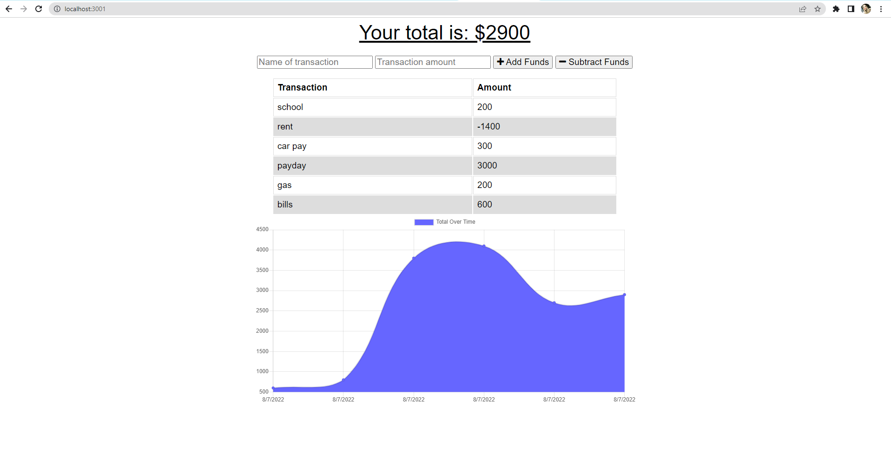

# Budget_Tracker_PWA
  
    

 ## Table of Contents:  
[1. Description](#Description)  
[2. Acceptance Criteria](#Acceptance-Criteria)  
[3. Installation](#Installation)    
[4. License Details](#License-Details)  
[5. Submission](#Submission)   
[6. Questions](#Questions) 

## Description:
Budget Tracker is a progressive web application that allows users to track their budgets by adding expenses and deposits to their budget through the "Add/Subtract Funds" buttons. They are able to add a transaction with or without a connection. When a user enters a transaction while offline, these transactions are stored in the indexedDB, and transferred to the database when the user comes back online.

## Acceptance Criteria:

 - GIVEN a budget tracker without an internet connection

- WHEN the user inputs an expense or deposit

- THEN they will receive a notification that they have added an expense or deposit

- WHEN the user reestablishes an internet connection

 - THEN the deposits or expenses added while they were offline are added to their transaction history and their totals are updated


## Installation:

```
    - npm i
    - npm start
    
```
 

## License Details: 

 This project is under no license.  

## Submission:

 [Github repository](https://github.com/Ymuzhych/Budget_Tracker_PWA)

## Questions:
 Here is a link to my github:  

https://github.com/Ymuzhych 

 Email me at:  myuliia2018@gmail.com  

Questions?